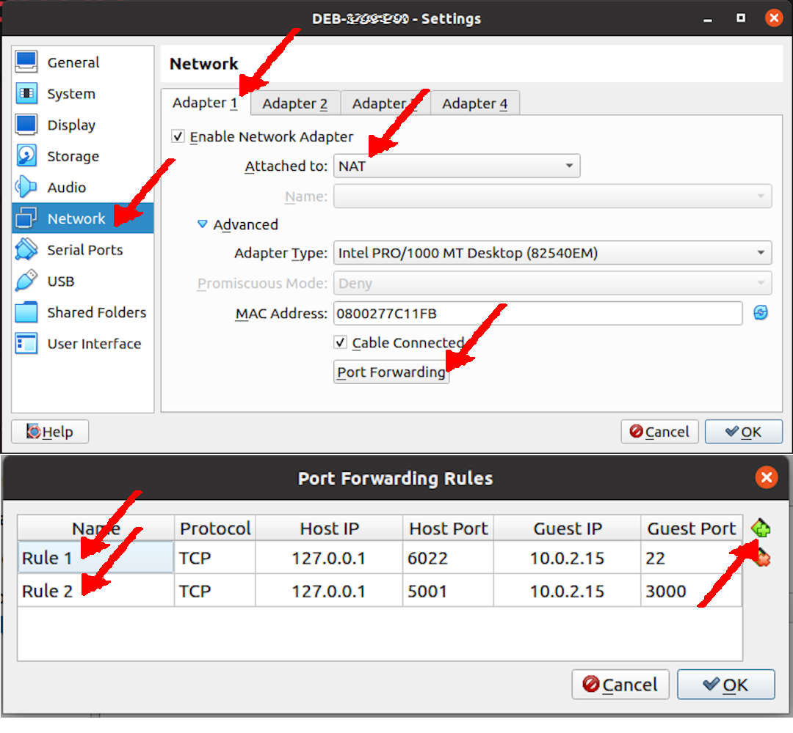

# 241saurus by BinKadal, Sdn, Bhd.

[&#x213C;](#idxXXX)<br id="idx000">
## Table of Content (Toc)
* [Network Address Translation (NAT) Settings](#idx001)
* [File .gitignore](#idx002)
* [Debian Packages](#idx003)
* [Removed Packages](#idx004)
* [Install NVM/node.js](#idx005)
* [Remove Old Node.js](#idx006)

[&#x213C;](#)<br id="idx001">
## Network Address Translation (NAT) Settings

Docusaurus is using local port 3000. 
On your VirtualBox, you must redirect/translate the local port 3000 to the host port 5001.

* VirtualBox Settings
  * Network:Adapter1:
    * Enable Network Adapter
    * Attached to: NAT
    * Port Forwarding:
      * 127.0.0.1:5001 (Host) --- 10.0.2.15:3000 (Guest)

<br><br>

[&#x213C;](#)<br id="idx002">
## File .gitignore

Don't push the node.js files to GitHub! Copy from the following into your .gitignore file.
https://raw.githubusercontent.com/cbkadal/241saurus/master/.gitignore

[&#x213C;](#)<br id="idx003">
## Debian Packages

Make sure the following Debian packages are present in your system.

```
# ROOT privilege.
export DEBS="
aptitude
git
sudo
vim
"
date;
time apt-get install $DEBS -y

```

[&#x213C;](#)<br id="idx004">
## Removed Packages
Remove the current "yarn" version used by the Jekyll installation. It will be replaced with a newer one.
That old "yarn" is in the "cmdtest" package.

```
# ROOT privilege.
aptitude purge cmdtest

```

[&#x213C;](#)<br id="idx005">
## Install NVM/node.js
Docusaurus needs a huge JavaScript runtime environment package called "node.js." 
Check https://github.com/nvm-sh/nvm/releases for the latest NVM package release. 
Currently, it is version 0.39.7.

```
# USER privilege.
NVM_RELEASE="v0.39.7"
wget -qO- https://raw.githubusercontent.com/nvm-sh/nvm/$NVM_RELEASE/install.sh | bash

```

[&#x213C;](#)<br id="idx006">
### Check Node.js Version

Check for the latest LTS (Long-Term Support) version.

```
# USER privilege.
nvm ls-remote

```

For example,
* the latest LTS version (NEW_NODE_VERSION) is "v20.12.0"
* the installed version (OLD_NODE_VERSION) is "v20.11.1"


[&#x213C;](#)<br id="idx005"><br>
### Install Node.js

Set NEW_NODE_VERSION

```
# USER privilege.
NEW_NODE_VERSION="v20.12.0"
nvm install $NEW_NODE_VERSION
sleep 1
node -v

```

[&#x213C;](#)<br id="idx006"><br>
### Remove Old Node.js (if exists)

```
# USER privilege.
OLD_NODE_VERSION="v20.11.1"
nvm uninstall $OLD_NODE_VERSION
sleep 1
rm -rfv $HOME/.nvm/versions/node/$OLD_NODE_VERSION/
node -v

```

[&#x213C;](#)<br id="idx007"><br>
## YARN (USER)

```
npm install -g yarn
sleep 2
yarn --version
# UPDATE 10.5.0
# npm install -g npm@10.5.0

```

[&#x213C;](#)<br id="idx007"><br>
## Docusaurus (USER) 

```
npx create-docusaurus@latest Docusaurus classic --typescript

```

[&#x213C;](#)<br id="idx008"><br>
## Start Docusaurus (USER)

```
cd Docusaurus
npm run start -- --host 0.0.0.0

```

[&#x213C;](#)<br id="idx009"><br>
## docusaurus.config.js

```
  title: '241saurus',               // Or else
  tagline: 'This is the Way!',      // Or else
  favicon: 'img/favicon.ico',       // Or else
  url: 'https://cbkadal.github.io', // Or else
  baseUrl: '/241saurus/',           // Or else
  organizationName: 'cbkadal',      // (Usually your GitHub org/user name)
  projectName: '241saurus',         // (Usually your repo name)
  trailingSlash: true,              // "true" or "false"

```

[&#x213C;](#)<br id="idx009"><br>
## Deploy To GitHub

```
export GIT_USER="cbkadal"
export USE_SSH="true"
yarn deploy

```

[&#x213C;](#)<br id="idx009"><br>

* <https://docusaurus.io/docs/>
* <https://cbkadal.github.io/231saurus/docs/AP01/02/>

[&#x213C;](#)<br id="idxXXX"><br>

<pre><strong>
REV01: Wed 27 Mar 2024 10:00
START: Sun 17 Mar 2024 14:00
</strong></pre>

